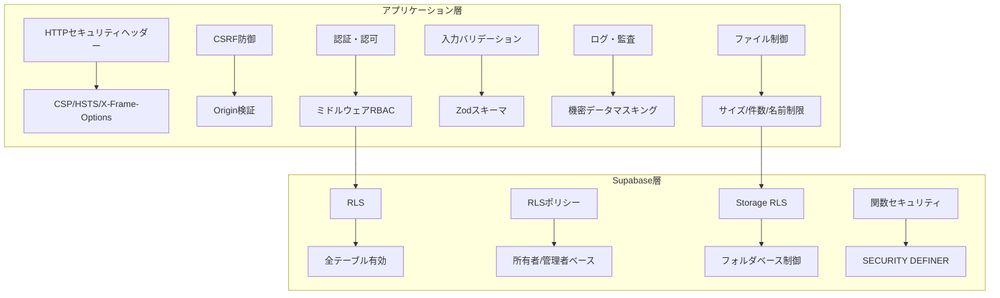

# セキュリティ実装一覧


## 1. アプリケーション側（Next.js）

### 1.1 HTTPセキュリティヘッダー

[next.config.ts](file:///c:/Users/jtths/Desktop/School_Progress%20Management/next.config.ts) で以下のヘッダーを全リクエストに適用しています：

| ヘッダー | 設定値 | 目的 |
|---------|--------|------|
| **Content-Security-Policy** | `default-src 'self'; script-src 'self' 'unsafe-inline' 'unsafe-eval'; style-src 'self' 'unsafe-inline' https://fonts.googleapis.com; font-src 'self' https://fonts.gstatic.com; img-src 'self' data: https://*.supabase.co; connect-src 'self' https://*.supabase.co wss://*.supabase.co; frame-ancestors 'none';` | XSS攻撃対策、Supabase APIへの接続のみ許可、iframeによる埋め込み禁止 |
| **X-Content-Type-Options** | `nosniff` | MIMEタイプスニッフィング防止 |
| **X-Frame-Options** | `DENY` | クリックジャッキング防止 |
| **Referrer-Policy** | `strict-origin-when-cross-origin` | リファラー情報の制御 |
| **Permissions-Policy** | `camera=(), microphone=(), geolocation=()` | ブラウザ機能の利用制限 |
| **Strict-Transport-Security** | `max-age=31536000; includeSubDomains; preload` | HTTPS強制（HSTS） |

---

### 1.2 CSRF防御

[security.ts](file:///c:/Users/jtths/Desktop/School_Progress%20Management/src/utils/security.ts) に [validateRequestOrigin()](file:///c:/Users/jtths/Desktop/School_Progress%20Management/src/utils/security.ts#3-28) 関数を実装：

```typescript
export async function validateRequestOrigin(): Promise<boolean> {
    const origin = headersList.get("origin");
    const host = headersList.get("host");
    // OriginヘッダーとHostヘッダーの一致を検証
    return originUrl.host === host;
}
```

**適用箇所**：すべての Server Action で呼び出し
- [admin/dashboard/actions.ts](file:///c:/Users/jtths/Desktop/School_Progress%20Management/src/app/admin/dashboard/actions.ts)
- [student/dashboard/actions.ts](file:///c:/Users/jtths/Desktop/School_Progress%20Management/src/app/student/dashboard/actions.ts)

---

### 1.3 認証・認可（RBAC）

#### ミドルウェアによるルート保護

[middleware.ts](file:///c:/Users/jtths/Desktop/School_Progress%20Management/src/middleware.ts) + [supabase/middleware.ts](file:///c:/Users/jtths/Desktop/School_Progress%20Management/src/utils/supabase/middleware.ts)

| 対象パス | 制御 |
|---------|------|
| `/login`, `/auth`, `/manual_demo` | 認証不要（公開） |
| その他すべて | 未認証ユーザーは `/login` へリダイレクト |
| `/admin/*` | `role_id = 'admin'` 以外はアクセス拒否 |
| `/student/*` | `role_id = 'student'` または `'admin'` のみアクセス可 |

#### Server Action での二重チェック

各 Server Action 内で再度認証・認可を確認：

```typescript
const { data: { user } } = await supabase.auth.getUser();
if (!user) return { error: "Unauthorized" };

const { data: profile } = await supabase.from("profiles").select("role_id")...;
if (profile?.role_id !== "admin") return { error: "Unauthorized" };
```

---

### 1.4 入力バリデーション（Zod）

[schemas.ts](file:///c:/Users/jtths/Desktop/School_Progress%20Management/src/utils/schemas.ts) に型安全なスキーマを定義：

| スキーマ | 検証項目 |
|---------|---------|
| `LoginSchema` | email形式、パスワード必須 |
| `SignupSchema` | email形式、パスワード6文字以上、氏名必須、コースID必須 |
| `UpdateStudentProfileSchema` | 氏名1-100文字、コースID必須かつ50文字以内 |
| `CreateApplicationSchema` | 企業名・職種必須 |
| `UpdateApplicationSchema` | 上記＋ステータスのenum検証 |
| `UploadAttachmentSchema` | カテゴリのenum検証（`resume`, `cv`, `portfolio`, `other`） |
| `ApplicationStatusEnum` | 許可されたステータス値のみ |
| `DocumentResultEnum` | 許可された審査結果のみ |

**その他のバリデーション**：
- UUID形式チェック（`z.string().uuid()`）
- ファイルサイズ制限（5MB）
- ファイル件数制限（1応募あたり最大10ファイル）

---

### 1.5 ログ・監査証跡

[logger.ts](file:///c:/Users/jtths/Desktop/School_Progress%20Management/src/utils/logger.ts) に包括的なログシステムを実装：

#### 収集情報

| カテゴリ | フィールド |
|---------|-----------|
| **基本情報** | `request_id`, `environment`, `severity`, `created_at` |
| **誰が** | `user_id`, `ip_address`, `user_agent`, `role` |
| **何を** | `action_type`, `resource`, `action`, `endpoint` |
| **結果** | `status_code`, `duration_ms`, `error_message`, `stack_trace` |
| **変化内容** | `old_value`, `new_value`, `changed_fields`, `input_params` |

#### セキュリティ機能

- **機密データのマスキング**：`password`, `token`, `secret`, `credit_card`, `api_key` キーを `********` に置換
- **メールアドレスのマスキング**：`a***@example.com` 形式に変換
- **リクエストIDの追跡**：ミドルウェアで `X-Request-ID` を生成

---

### 1.6 ファイルアップロード対策

[student/dashboard/actions.ts](file:///c:/Users/jtths/Desktop/School_Progress%20Management/src/app/student/dashboard/actions.ts) の [uploadAttachment](file:///c:/Users/jtths/Desktop/School_Progress%20Management/src/app/student/dashboard/actions.ts#153-268) 関数：

| 対策 | 実装 |
|------|------|
| サイズ制限 | 5MB以下のみ許可 |
| 件数制限 | 1応募あたり最大10ファイル（サーバー側検証） |
| 所有権確認 | アップロード前に `application.student_id === user.id` を検証 |
| 安全なファイル名 | タイムスタンプ＋ランダム文字列で再生成 |
| パス組み立て | `{applicationId}/{category}/{safeFileName}` 形式で階層化 |

---

## 2. Supabase側

### 2.1 Row Level Security（RLS）

**全テーブルでRLSが有効化されています**：

| テーブル | RLS |
|---------|-----|
| `activity_logs` | ✅ 有効 |
| `application_attachments` | ✅ 有効 |
| `applications` | ✅ 有効 |
| `courses` | ✅ 有効 |
| `profiles` | ✅ 有効 |
| `roles` | ✅ 有効 |
| `students` | ✅ 有効 |

---

### 2.2 RLSポリシー詳細

#### activity_logs

| ポリシー名 | 操作 | 条件 |
|-----------|------|------|
| Admins can view activity logs | SELECT | `is_admin()` |
| Users can insert own activity logs | INSERT | `user_id = auth.uid()` |

#### application_attachments

| ポリシー名 | 操作 | 条件 |
|-----------|------|------|
| Admin can view all attachments | SELECT | `is_admin()` |
| Student can delete own attachments | DELETE | 自分のapplication_idに紐づく場合のみ |
| Student can insert own attachments | INSERT | 自分のapplication_idに紐づく場合のみ |
| Student can view own attachments | SELECT | 自分のapplication_idに紐づく場合のみ |

#### applications

| ポリシー名 | 操作 | 条件 |
|-----------|------|------|
| Admins can manage all applications | ALL | `is_admin()` |
| Students can manage own applications | ALL | `student_id = auth.uid()` |

#### profiles

| ポリシー名 | 操作 | 条件 |
|-----------|------|------|
| Admins can delete all profiles | DELETE | `is_admin()` |
| Admins can update all profiles | UPDATE | `is_admin()` |
| Admins can view all profiles | SELECT | `is_admin()` |
| Users can view own profile | SELECT | `auth.uid() = id` |

#### students

| ポリシー名 | 操作 | 条件 |
|-----------|------|------|
| Admins can delete all students | DELETE | `is_admin()` |
| Admins can update all students | UPDATE | `is_admin()` |
| Admins can view all students | SELECT | `is_admin()` |
| Students can view own record | SELECT | `auth.uid() = id` |

#### courses / roles

| ポリシー名 | 操作 | 条件 |
|-----------|------|------|
| Public viewable | SELECT | `true`（誰でも参照可） |

---

### 2.3 Storage RLSポリシー

バケット：`application-attachments`（**非公開バケット**）

| ポリシー名 | 操作 | 条件 |
|-----------|------|------|
| Admin can select all files | SELECT | `is_admin()` |
| Student can select own files | SELECT | フォルダ名が自分のapplication_idの場合 |
| Student can upload own files | INSERT | フォルダ名が自分のapplication_idの場合 |
| Student can delete own files | DELETE | フォルダ名が自分のapplication_idの場合 |

---

### 2.4 管理者判定関数

```sql
CREATE OR REPLACE FUNCTION public.is_admin()
  RETURNS boolean
  LANGUAGE plpgsql
  SECURITY DEFINER
  SET search_path TO 'public'
AS $$
BEGIN
  RETURN EXISTS (
    SELECT 1 FROM public.profiles
    WHERE id = auth.uid() AND role_id = 'admin'
  );
END;
$$
```

- `SECURITY DEFINER`：関数実行者の権限ではなく、定義者の権限で実行
- `SET search_path TO 'public'`：search_path攻撃を防止

---

### 2.5 新規ユーザー作成時の自動処理

```sql
CREATE OR REPLACE FUNCTION public.handle_new_user()
  RETURNS trigger
  LANGUAGE plpgsql
  SECURITY DEFINER
AS $$
BEGIN
    INSERT INTO public.profiles (id, full_name, role_id)
    VALUES (new.id, new.raw_user_meta_data->>'full_name', 'student');
    
    INSERT INTO public.students (id, course_id)
    VALUES (new.id, (new.raw_user_meta_data->>'course_id')::UUID);
    
    RETURN new;
END;
$$
```

- 新規ユーザー作成時にデフォルトで `role_id = 'student'` を割り当て
- 管理者権限は手動付与が必要（エスカレーション防止）

---

## 3. 要改善事項

> [!WARNING]
> ### Leaked Password Protection が無効
> Supabase Auth のパスワード漏洩チェック機能が無効になっています。
> HaveIBeenPwned.org と連携して既知の漏洩パスワードの使用を防ぐことができます。
> 
> **対応**：[Supabase Dashboard](https://supabase.com/docs/guides/auth/password-security#password-strength-and-leaked-password-protection) から有効化してください。

---

## 4. セキュリティ対策サマリー



---

## 5. 参考ファイル一覧

| ファイル | 役割 |
|---------|------|
| [next.config.ts](file:///c:/Users/jtths/Desktop/School_Progress%20Management/next.config.ts) | セキュリティヘッダー設定 |
| [middleware.ts](file:///c:/Users/jtths/Desktop/School_Progress%20Management/src/middleware.ts) | Request ID生成 |
| [supabase/middleware.ts](file:///c:/Users/jtths/Desktop/School_Progress%20Management/src/utils/supabase/middleware.ts) | 認証・RBAC制御 |
| [security.ts](file:///c:/Users/jtths/Desktop/School_Progress%20Management/src/utils/security.ts) | CSRF防御 |
| [schemas.ts](file:///c:/Users/jtths/Desktop/School_Progress%20Management/src/utils/schemas.ts) | 入力バリデーション定義 |
| [logger.ts](file:///c:/Users/jtths/Desktop/School_Progress%20Management/src/utils/logger.ts) | ログ・監査システム |
| [login/actions.ts](file:///c:/Users/jtths/Desktop/School_Progress%20Management/src/app/login/actions.ts) | 認証アクション |
| [admin/dashboard/actions.ts](file:///c:/Users/jtths/Desktop/School_Progress%20Management/src/app/admin/dashboard/actions.ts) | 管理者アクション |
| [student/dashboard/actions.ts](file:///c:/Users/jtths/Desktop/School_Progress%20Management/src/app/student/dashboard/actions.ts) | 学生アクション |
| [supabase.md](file:///c:/Users/jtths/Desktop/School_Progress%20Management/supabase.md) | Supabase仕様書 |
| [Dockerfile](file:///c:/Users/jtths/Desktop/School_Progress%20Management/Dockerfile) | コンテナビルド設定 |

---

## 6. 追加推奨セキュリティ対策

### 6.1 Dockerfileの改善点

現在のDockerfile分析結果：

**✅ 良い点**：
- マルチステージビルド使用（イメージサイズ最小化）
- Alpine Linux使用（攻撃対象面の縮小）
- `npm ci` 使用（再現性のあるビルド）
- standalone モード使用（最小限のファイルのみ含む）

**⚠️ 改善推奨**：

#### 1. 非rootユーザーでの実行

```dockerfile
# 推奨：実行ステージに追加
FROM node:20-alpine AS runner
WORKDIR /app

# 非rootユーザーを作成
RUN addgroup --system --gid 1001 nodejs
RUN adduser --system --uid 1001 nextjs

# ファイルの所有権を変更
COPY --from=builder --chown=nextjs:nodejs /app/public ./public
COPY --from=builder --chown=nextjs:nodejs /app/.next/standalone ./
COPY --from=builder --chown=nextjs:nodejs /app/.next/static ./.next/static

# 非rootユーザーに切り替え
USER nextjs

EXPOSE 3000
CMD ["node", "server.js"]
```

> [!IMPORTANT]
> コンテナがroot権限で実行されている場合、コンテナエスケープ攻撃時のリスクが大きくなります。

#### 2. ヘルスチェックの追加

```dockerfile
HEALTHCHECK --interval=30s --timeout=10s --start-period=5s --retries=3 \
  CMD wget --no-verbose --tries=1 --spider http://localhost:3000/ || exit 1
```

#### 3. セキュリティラベルの追加

```dockerfile
LABEL org.opencontainers.image.source="https://github.com/your-repo"
LABEL org.opencontainers.image.description="School Progress Management System"
LABEL org.opencontainers.image.licenses="MIT"
```

---

### 6.2 .dockerignoreの改善

現在の設定に問題があります：

```diff
# 現在の.dockerignore
.env*
-!.env.local  # ← 危険！.env.localがDockerイメージに含まれる可能性
+# .env.localは含めない（実行時に環境変数で注入すべき）
```

> [!CAUTION]
> [.env.local](file:///c:/Users/jtths/Desktop/School_Progress%20Management/.env.local) をDockerイメージに含めると、認証情報がイメージレイヤーに永続化されます。
> AWS LightSail の環境変数設定で注入すべきです。

---

### 6.3 AWS LightSail コンテナサービス向け設定

#### 環境変数の設定（LightSail Console）

以下の環境変数をLightSailコンソールで設定してください：

| 変数名 | 説明 | 設定場所 |
|-------|------|---------|
| `NEXT_PUBLIC_SUPABASE_URL` | Supabase APIエンドポイント | Container環境変数 |
| `NEXT_PUBLIC_SUPABASE_ANON_KEY` | Supabase公開キー | Container環境変数 |
| `NODE_ENV` | `production` | Container環境変数 |

#### LightSail固有のセキュリティ考慮事項

| 項目 | 推奨設定 |
|-----|---------|
| **HTTPS終端** | LightSailロードバランサーでSSL/TLS終端を設定 |
| **カスタムドメイン** | 信頼できるSSL証明書を適用 |
| **コンテナログ** | CloudWatch Logsへのログ転送を有効化 |
| **ポート制限** | ポート3000のみ公開（LightSailデフォルト） |
| **プライベートコンテナ** | 内部通信はプライベートエンドポイント使用 |

---

### 6.4 Supabase追加セキュリティ設定

#### 現在無効の機能

| 機能 | 状態 | 推奨 |
|-----|-----|-----|
| **Leaked Password Protection** | ❌ 無効 | ✅ [有効化推奨](https://supabase.com/docs/guides/auth/password-security#password-strength-and-leaked-password-protection) |

#### 追加推奨設定

| 設定カテゴリ | 推奨事項 | 設定場所 |
|------------|---------|---------|
| **Auth > URL Configuration** | サイトURL・リダイレクトURLを本番ドメインに限定 | Supabase Dashboard |
| **Auth > Providers** | 未使用の認証プロバイダーを無効化 | Supabase Dashboard |
| **Auth > Rate Limits** | 認証試行のレート制限を有効化 | Supabase Dashboard |
| **Database > SSL** | SSL接続を強制 | Connection Strings |
| **API > Rate Limiting** | 必要に応じてAPIレート制限を設定 | Supabase Dashboard |

---

### 6.5 アプリケーション追加対策

#### 現在未実装で推奨する対策

| 対策 | 重要度 | 説明 |
|-----|-------|------|
| **レート制限** | 高 | ログイン試行・API呼び出しの制限（例: upstash/ratelimit） |
| **セッションタイムアウト** | 中 | 非アクティブ時の自動ログアウト |
| **パスワード強度要件** | 中 | ZodスキーマでUIレベルでも強度チェック |
| **アカウントロックアウト** | 中 | 連続失敗後のアカウント一時停止 |
| **2要素認証（MFA）** | 中〜高 | Supabase Auth MFA機能の検討 |
| **監査ログのバックアップ** | 高 | activity_logsの定期バックアップ |
| **脆弱性スキャン** | 高 | `npm audit` をCI/CDに組み込み |

#### npm auditの実行推奨

```bash
# 依存関係の脆弱性チェック
npm audit

# 重大な脆弱性のみ表示
npm audit --audit-level=high

# 自動修正（可能な場合）
npm audit fix
```

---

### 6.6 推奨Dockerfile（完全版）

```dockerfile
# 1. 依存関係のインストールステージ
FROM node:20-alpine AS deps
RUN apk add --no-cache libc6-compat
WORKDIR /app

COPY package.json package-lock.json ./
RUN npm ci --only=production=false

# 2. ビルドステージ
FROM node:20-alpine AS builder
WORKDIR /app
COPY --from=deps /app/node_modules ./node_modules
COPY . .

# ビルド時の環境変数（NEXT_PUBLIC_*のみ）
ARG NEXT_PUBLIC_SUPABASE_URL
ARG NEXT_PUBLIC_SUPABASE_ANON_KEY
ENV NEXT_PUBLIC_SUPABASE_URL=$NEXT_PUBLIC_SUPABASE_URL
ENV NEXT_PUBLIC_SUPABASE_ANON_KEY=$NEXT_PUBLIC_SUPABASE_ANON_KEY

RUN npm run build

# 3. 実行ステージ
FROM node:20-alpine AS runner
WORKDIR /app

ENV NODE_ENV=production
ENV PORT=3000
ENV HOSTNAME="0.0.0.0"

# セキュリティ：非rootユーザーを作成
RUN addgroup --system --gid 1001 nodejs && \
    adduser --system --uid 1001 nextjs

# 必要なファイルのみコピー（所有権も設定）
COPY --from=builder --chown=nextjs:nodejs /app/public ./public
COPY --from=builder --chown=nextjs:nodejs /app/.next/standalone ./
COPY --from=builder --chown=nextjs:nodejs /app/.next/static ./.next/static

# 非rootユーザーに切り替え
USER nextjs

# ヘルスチェック
HEALTHCHECK --interval=30s --timeout=10s --start-period=5s --retries=3 \
  CMD wget --no-verbose --tries=1 --spider http://localhost:3000/ || exit 1

EXPOSE 3000

# メタデータ
LABEL org.opencontainers.image.title="School Progress Management"
LABEL org.opencontainers.image.description="職業訓練校進捗管理システム"

CMD ["node", "server.js"]
```

---

## 7. セキュリティチェックリスト

### 導入済み ✅

- [x] HTTPセキュリティヘッダー（CSP, HSTS, X-Frame-Options等）
- [x] CSRF防御（Origin検証）
- [x] RBACによる認証・認可
- [x] Zodによる入力バリデーション
- [x] 監査ログシステム
- [x] 機密データのマスキング
- [x] ファイルアップロード制限
- [x] 全テーブルRLS有効
- [x] Storage RLSポリシー
- [x] マルチステージDockerビルド
- [x] .gitignoreで機密ファイル除外
- [x] **非rootユーザーでのDocker実行**（2025-12-26対応）
- [x] **.dockerignoreから[.env.local](file:///c:/Users/jtths/Desktop/School_Progress%20Management/.env.local)除外**（2025-12-26対応）
- [x] **Dockerヘルスチェック追加**（2025-12-26対応）

### 要対応 ⚠️

- [ ] **Leaked Password Protection有効化**（Supabase Dashboard）
- [ ] **AWS LightSail環境変数設定**
- [ ] レート制限の実装
- [ ] npm auditの定期実行
- [ ] セッションタイムアウト設定
