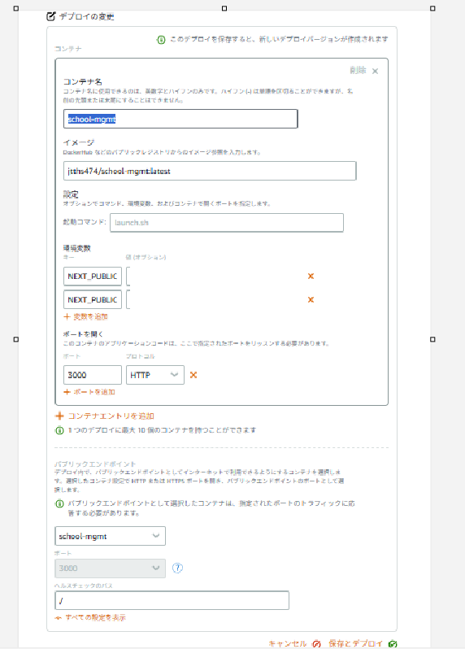

# 訓練校 進捗管理システム (School Progress Management System)

このシステムは、職業訓練校などの教育機関において、受講生の就職活動状況や学習進捗を効率的に管理するためのプラットフォームです。
受講生は自身の応募状況を記録し、管理者は全受講生の状況をリアルタイムで把握・分析できます。

## 🚀 主な機能

### 👨‍🎓 受講生向け機能
- **ダッシュボード**: 自身の進捗状況を一覧で確認
- **応募管理**: 応募した企業の登録、ステータス変更（応募中、選考中、内定など）
- **書類提出**: 履歴書、職務経歴書、ポートフォリオなどのファイルを企業ごとにアップロード・管理
- **選考準備**: 面接準備や書類作成のチェックリスト管理

### 👨‍💼 管理者向け機能
- **受講生一覧**: 全受講生の基本情報、コース、卒業予定月の管理
- **高度な検索・フィルタリング**:
  - キーワード検索（受講生名、企業名、職種、書類名）
  - コース、ステータス、書類選考結果、卒業年月による絞り込み
- **リアルタイムKPI分析**:
  - 検索条件に連動した「総応募数」「書類通過率」「内定率」の動的表示
- **提出書類確認**: 受講生が提出した書類の閲覧・ダウンロード
- **受講生情報編集**: プロフィールやコース情報の更新、削除

## 🛠️ 技術スタック

- **Frontend**: Next.js (App Router), React, TypeScript
- **Styling**: Tailwind CSS, Lucide React (Icons)
- **Backend/Database**: Supabase (PostgreSQL, Auth, Storage)
- **Testing/Verification**: WebP Video Recording, Browser Automation

## 🏃‍♂️ 開発環境のセットアップ

### 1. リポジトリのクローン
このディレクトリに移動します。

### 2. 依存関係のインストール
```bash
npm install
```

### 3. 環境変数の設定
`.env.local` ファイルを作成し、以下の項目を設定してください：
```env
NEXT_PUBLIC_SUPABASE_URL=your_supabase_project_url
NEXT_PUBLIC_SUPABASE_ANON_KEY=your_supabase_anon_key
```

### 4. データベースセットアップ
Supabaseで以下のテーブルを作成してください：
- `profiles`: ユーザーの基本情報（管理者フラグ含む）
- `courses`: コース情報
- `students`: 受講生詳細（コースID、卒業予定日）
- `applications`: 応募情報
- `application_attachments`: 提出書類のメタデータ

※ ストレージバケット `application-attachments` の作成も必要です。

## 🐳 Docker 利用方法

このプロジェクトには Dockerfile が含まれており、コンテナ環境での実行やデプロイが可能です。

### 1. 開発用イメージの作成
以下のコマンドで Docker イメージをビルドします。
```bash
docker build -t school-mgmt .
```

### 2. ローカルでのコンテナ起動
ビルドしたイメージを使用してコンテナを起動します。
```bash
docker run -p 3000:3000 --env-file .env.local school-mgmt
```
ブラウザで [http://localhost:3000](http://localhost:3000) にアクセスして確認できます。

### 3. Docker Hub へのプッシュ
Docker Hub にイメージを保存する手順です（ユーザー名 `jtths474` を使用、google認証ならいらない）。

1. **ドッカーbuild**
```bash
docker build -t jtths474/school-mgmt:latest .
```

2. **ログイン**
```bash
docker login -u jtths474
```

3. **プッシュ**
```bash
   docker push jtths474/school-mgmt:latest
   ```

## 📁 ディレクトリ構造
- `src/app`: ページコンポーネントとサーバーアクション
- `src/components`: 再利用可能なUIコンポーネント
- `src/utils`: Supabaseクライアントやヘルパー関数
- `public`: 静的アセット

## 📜 ライセンス
このプロジェクトは私的な進捗管理用として公開されています。

## ☁️ Amazon Lightsail デプロイ手順

Amazon Lightsail のコンテナサービスを使用してデプロイする簡潔な手順です。

### 1. 事前準備
- Docker Hub にイメージがプッシュされていること（上述の「Docker Hub へのプッシュ」を参照）。

### 2. Lightsail コンテナサービスの作成
1. AWS コンソールで **Lightsail** に移動します。
2. **コンテナ** タブから「コンテナサービスを作成」をクリックします。
3. 容量（Nano, Micro など）を選択します。

### 3. デプロイ設定
1. 「デプロイメントの作成」をクリックします。
2. **イメージ**: `jtths474/school-mgmt:latest` (Docker Hub のイメージパス)
3. **オープンポート**: `3000` (HTTP)
4. **環境変数**:
   - `NEXT_PUBLIC_SUPABASE_URL`: (Supabase の URL)
   - `NEXT_PUBLIC_SUPABASE_ANON_KEY`: (Supabase の API キー)
   - `NODE_ENV`: `production`



### 4. 公開
1. 「パブリックエンドポイント」に作成したコンテナを指定します。
2. 保存してデプロイが完了すると、提供される URL からアクセス可能になります。

